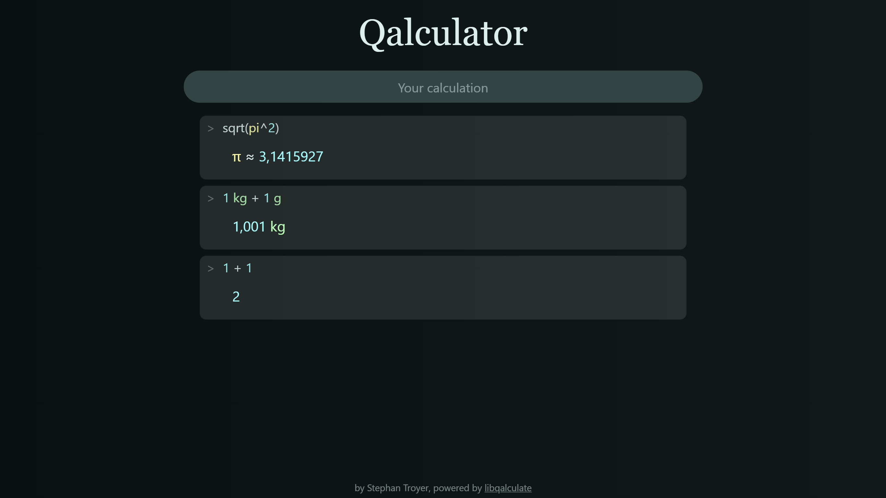

# Qalculator

A calculator for the web, based on [libqalculate by Hanna Knutsson](https://github.com/Qalculate/libqalculate)

## Development

This repo is split into two parts:

-   `lib` is responsible for building a web assembly based on `libqalculate`.
-   `website` is the progressive web app (a SvelteKit website)
